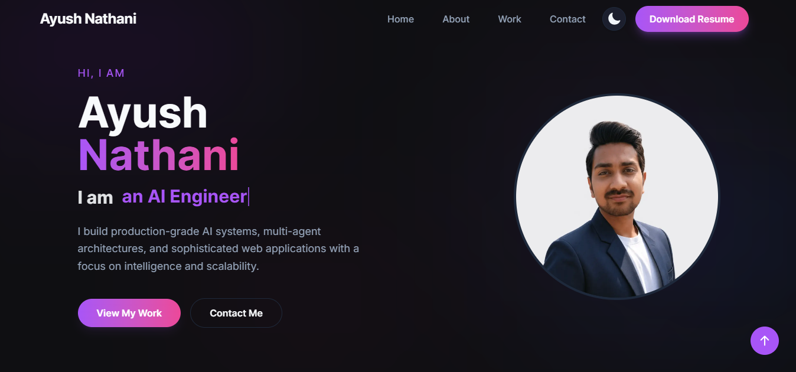
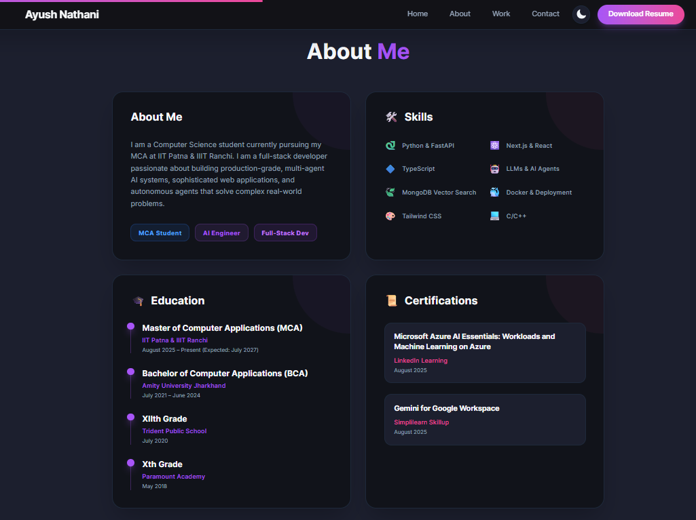
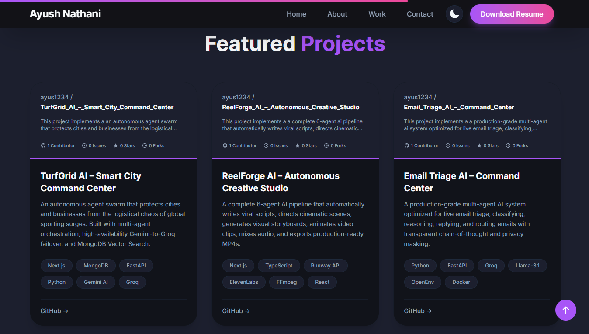
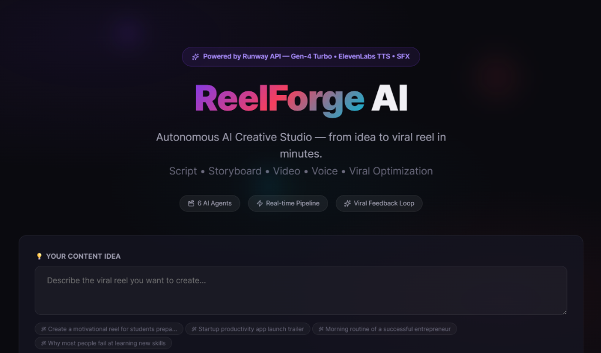
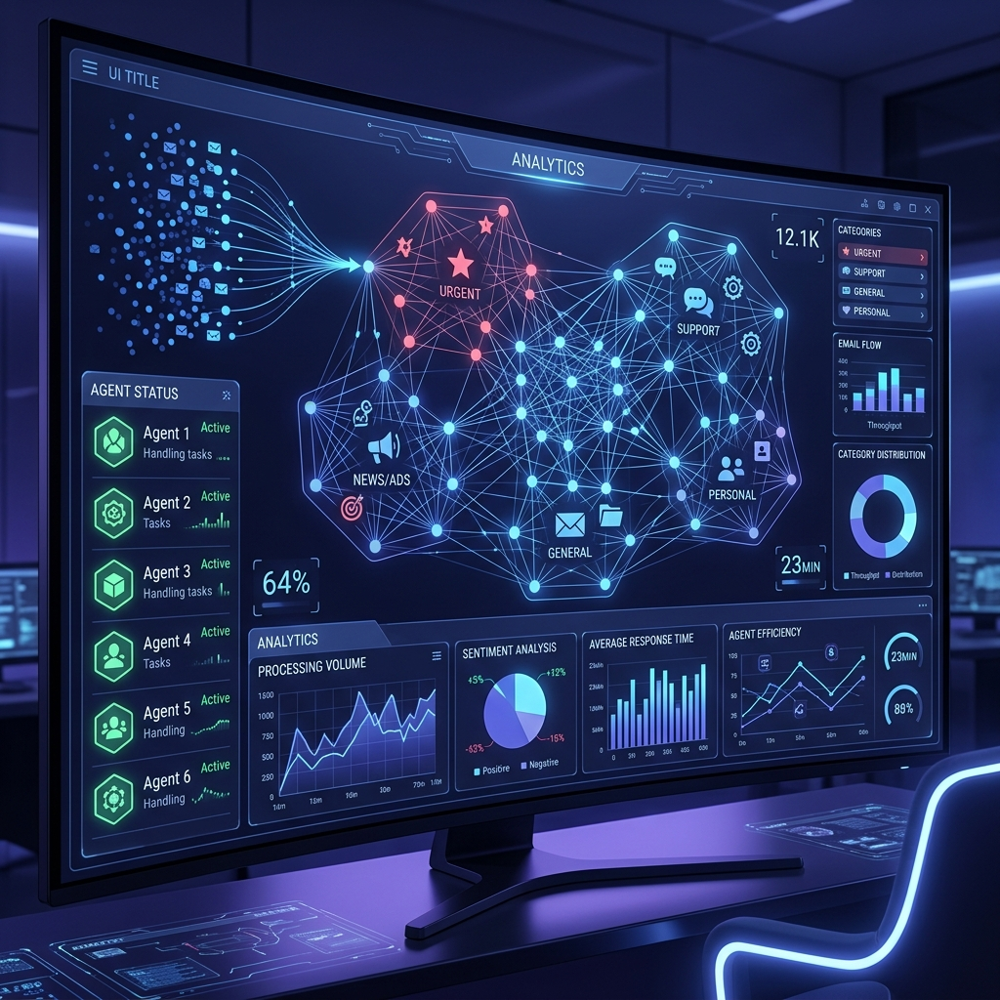

# Ayush Nathani - Personal Portfolio

A modern, high-performance portfolio website built with the latest web technologies. This project showcases my skills, featured projects, and professional background with a premium, motion-rich aesthetic.

[](https://your-portfolio-link.vercel.app)
[](https://nextjs.org)
[](https://tailwindcss.com)

## 📸 Portfolio Walkthrough

### 1. Hero
<div align="center">
  
</div>

*The landing page features a modern, motion-rich hero section with dynamic typography, introducing the core expertise in AI and Full-Stack Engineering.*

### 2. About Me
<div align="center">
  
</div>

*A comprehensive overview of my professional background, paired with a visual grid highlighting proficiency in modern tools like Next.js, Python, and MongoDB Vector Search.*

### 3. Projects
<div align="center">
  
</div>

*A dedicated showcase of production-grade AI applications, complete with high-quality mockups, tech stack details, and links to live repositories.*

### 4. Contact Us
<div align="center">
  
</div>

*A sleek, responsive contact section integrated with a database for reliable, real-time message delivery and seamless user communication.*

## 🚀 Key Features

- **Standard-Setting Tech Stack**: Built with **Next.js 16 (App Router)**, **React 19**, and **Tailwind CSS 4** for cutting-edge performance and developer experience.
- **Dynamic Theming**: Seamless switching between premium Light and Dark modes using `next-themes`.
- **Advanced Animations**: motion-driven UI using **Framer Motion**, including:
  - Custom scroll progress tracking.
  - Interactive magnetic effects for buttons and links.
  - Staggered entrance animations for refined reveal effects.
- **Responsive & Liquid Layout**: Optimized for every screen size, from mobile devices to ultra-wide displays.
- **Clean Console Technology**: Custom console noise suppression to filter out browser extension warnings for a distraction-free development experience.
- **Interactive Elements**: Real-time typewriter effects, scroll-native navigation, and high-performance image optimization.

## 🛠️ Performance Tech Stack

- **Framework**: [Next.js 16 (App Router)](https://nextjs.org/)
- **UI Logic**: [React 19](https://react.dev/)
- **Styling**: [Tailwind CSS 4](https://tailwindcss.com/)
- **Animations**: [Framer Motion 12](https://www.framer.com/motion/)
- **Language**: [TypeScript](https://www.typescriptlang.org/)
- **Icons**: [Heroicons](https://heroicons.com/)
- **Deployment**: [Vercel](https://vercel.com)

## 📁 Featured Projects

### [1. TurfGrid AI – Smart City Command Center](https://github.com/ayus1234/turfgrid-ai)

*An autonomous agent swarm that protects cities and businesses from the logistical chaos of global sporting surges.*
- **Tech Stack**: Next.js, MongoDB Vector Search, FastAPI, Python, Gemini AI, Groq.
- **Key Features**: Multi-agent orchestration, high-availability Gemini-to-Groq failover, autonomous state-altering actions, real-time API integrations, and multi-tenant operational dashboard.

### [2. ReelForge AI – Autonomous Creative Studio](https://github.com/ayus1234/reelforge-ai)

*A complete 6-agent AI pipeline that automatically turns ideas into export-ready short videos.*
- **Tech Stack**: Next.js, TypeScript, Runway API, ElevenLabs, FFmpeg, React.
- **Key Features**: Auto-writes viral scripts, directs cinematic scenes, generates storyboards, animates clips, mixes audio, and scores viral potential.

### [3. Email Triage AI – Command Center](https://github.com/ayus1234/ai-email-triage-agent-openenv)

*A production-grade multi-agent AI system optimized for live email triage and workflow automation.*
- **Tech Stack**: Python, FastAPI, Groq, Llama-3.1, OpenEnv, Docker.
- **Key Features**: Autonomous classification, empathetic dynamic replying, secure department routing with transparent chain-of-thought and privacy masking.

## 🎓 About & Background

I am a Computer Science student currently pursuing my **MCA at IIT Patna & IIIT Ranchi**. I am a full-stack developer and AI engineer passionate about building production-grade, multi-agent AI systems, sophisticated web applications, and autonomous agents that solve complex real-world problems.

### 📜 Certifications
- **Microsoft Azure AI Essentials**: Workloads and Machine Learning on Azure.
- **Gemini for Google Workspace**: Leveraging generative AI for productivity.

## 🏁 Getting Started

### Prerequisites
- Node.js 18+ 
- npm or yarn

### Installation
```bash
npm install
# or
yarn install
```

### Development
```bash
npm run dev
```
Open [http://localhost:3000](http://localhost:3000) to view the application in development mode.

## 📦 Deployment
Optimized for deployment on **Vercel**. Simply connect your GitHub repository and it will deploy automatically.

---
Built with 💙 by [Ayush Nathani](https://github.com/ayus1234)